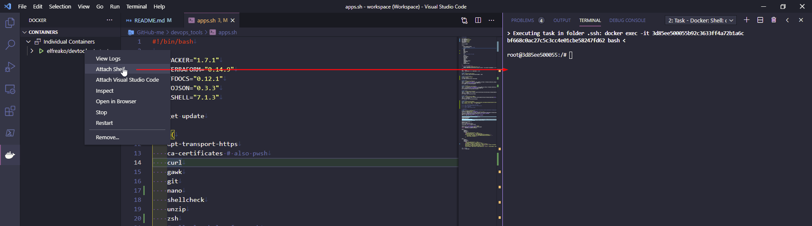

# Fluffy's DevOps Tools
Misc repo for DevOps tooling

https://hub.docker.com/u/elfreako

Docker image contains
- AWK v5.0.1
- [Azure CLI v2.27.1](https://docs.microsoft.com/en-us/cli/azure/what-is-azure-cli) (inc. Bicep v0.4.613 💪)
- Curl v7.68.0
- Git v2.25.1
- [HCL Packer v1.7.4](https://www.packer.io/downloads)
- [HCL Terraform Docs v0.15.0](https://github.com/terraform-docs/terraform-docs)
- [HCL Terraform v1.0.4](https://www.terraform.io/downloads.html)
- [HCL to JSON v0.3.3](https://github.com/tmccombs/hcl2json)
- Nano v4.8
- [Oh My ZSH v5.8](https://github.com/ohmyzsh/ohmyzsh)
- [PowerShell v7.1.4](https://github.com/PowerShell/PowerShell) (Modules: Azure v6.3.0, Pester v4.6.0)
- [Shellcheck v0.7.2](https://github.com/koalaman/shellcheck)
- Unzip v6.00

### Running Container

Run the container in detached mode and always load on boot:

```bash
docker run \
    --name devtools \                               # Assign a name to the container
    --detach \                                      # Run container in background and print container ID (or -d)
    --restart unless-stopped \                      # Restart policy to apply when a container exits (default "no")
    --tty \                                         # Allocate a pseudo-TTY (or -t)
    --volume '/etc/localtime':/etc/localtime:ro \   # map your timezone
    --volume '/etc/timezone':/etc/timezone:ro \     # map your timezone
    --volume '/mnt/c/Users/asdf/asdf':/data \       # mount a volume (or -v)
    --volume '/mnt/c/Users/zxcv/qwer':/data \       # mount a volume (or -v)
    --volume "${HOME}/.ssh":/root/.ssh \            # map your SSH key for git pulls
    elfreako/devtools
```

TIP: you can add your local SSH file to push/pull repos more easily by appending another volume:  `--volume "${HOME}/.ssh":/root/.ssh \`

Connect to container via ZSH:
```bash
docker exec -it devtools /bin/zsh

# -i = Keep STDIN open even if not attached
# -t = Allocate a pseudo-TTY
```

Disabled Git refresh for performance gain: https://github.com/ohmyzsh/ohmyzsh/issues/3288
`git config --global --add oh-my-zsh.hide-info 1`

### VSCode

Recommended usage when flipping between computers is using Settings Sync within VSCode: https://code.visualstudio.com/docs/editor/settings-sync

The Docker extension also allows you to attach the running container as a shell: https://marketplace.visualstudio.com/items?itemName=ms-azuretools.vscode-docker



v1.0.0: Added `/root/.vscode-server` folder to map volume locally to speed up extensions being installed/re-used. Add another volume mount: https://code.visualstudio.com/docs/remote/containers-advanced#_avoiding-extension-reinstalls-on-container-rebuild

```bash
-v "${HOME}/someFolder/.vscode-server":/root/.vscode-server
```

### WSL

Enabling container dropdown in Windows Terminal using WSL and Docker Desktop:
    Add a new profile in `settings.json` under `{}profiles.[]list`

```json
    {
        "commandline": "docker exec -it devtools /bin/zsh",
        "icon": "E:\\Downloads\\asdf\\qwer\\zxcv\\clover 2.png",
        "name": "Docker devtools",
        "tabColor": "#B018ED",
        "tabTitle": "Docker devtools"
    }
```


Docker with WSL tends to eat up memory at times, to restrict it, perform the following...

Turn off all WSL instances including docker-desktop:
```powershell
wsl --shutdown
notepad "$env:USERPROFILE/.wslconfig"
```

Edit `.wslconfig` file with notepad, adding these settings:
```powershell
[wsl2]
memory=3GB   # Limits VM memory in WSL 2 up to 3GB
processors=4 # Makes the WSL 2 VM use two virtual processors
```
...restart WSL

### MacOS Terminal

To enable auto load in MacOS Terminal, edit your Preferences and create/duplicate a Profile. Under the Shell menu of the profile, add `docker exec -it devtools /bin/zsh` inside the Run Command.

